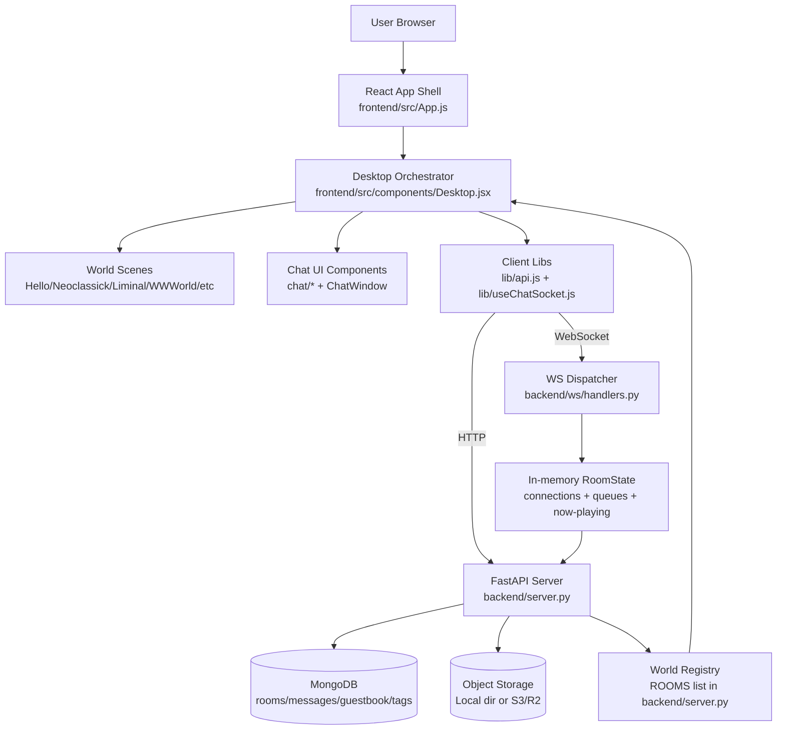

# g00dweird Chat System Diagram + Improvement Plan

## Current System Diagram

## How it Works (Today)

1. The frontend app boots through `App` and routes users into a logged-in `Desktop` experience after localStorage-backed identity is loaded.
2. `Desktop` composes world scenes and windowed UI (chat, jukebox, spray tools, profile windows, etc.) while per-feature components call shared client libraries for API and socket communication.
3. The backend exposes REST endpoints and WebSocket handling through FastAPI + `ws.handlers`, with room-centric realtime state held in memory (`RoomState`).
4. Persistent data (chat logs, guestbook, uploads metadata) is stored in MongoDB, while binary uploads stream into either local disk storage or S3/R2 depending on env config.
5. Available worlds are currently represented as a static room registry (`ROOMS`) in backend code and consumed by the frontend world/room picker flows.

## Improvement Opportunities (Prioritized)

### 1) Move from static room list to modular world manifests (highest impact)
- Problem: `ROOMS` is centralized, static, and mixes world content concerns into backend application code.
- Improvement: Introduce a `worlds/` manifest layer (JSON or typed Python modules) with schema validation (id, theme, assets, behavior flags, interaction mode).
- Benefit: New worlds can be added without touching shared server logic, matching the platform's multi-world direction.

### 2) Separate shared engine state from world behavior plugins
- Problem: Realtime state (`RoomState`) is generic but world-specific behavior hooks are limited and likely to drift into conditionals.
- Improvement: Add a world behavior registry (e.g., `on_join`, `ambient_tick`, `interaction_rules`, `media_policy`) keyed by room/theme.
- Benefit: Preserves clean shared systems while letting each world feel distinct.

### 3) Add a formal client-side world runtime boundary
- Problem: `Desktop` tends to become a central orchestrator for many concerns.
- Improvement: Introduce a world runtime interface per scene (`mountWorld`, `registerEntities`, `registerInteractions`, `teardown`) and keep chat/windows orthogonal.
- Benefit: Less coupling, safer iteration, easier performance tuning per world.

### 4) Persist key realtime queues to survive process restarts
- Problem: Current now-playing/queue state is in-memory only.
- Improvement: Store authoritative queue snapshots in MongoDB (or Redis) with optimistic versioning.
- Benefit: Better continuity for social/media features and horizontal scaling readiness.

### 5) Add observability for world-level performance and socket health
- Problem: No explicit world metrics boundary is documented.
- Improvement: Add structured metrics/logs: active users per world, WS fanout latency, upload failures, queue drift, reconnect rates.
- Benefit: Faster diagnosis of "alive/weird" behavior regressions and scaling issues.

### 6) Introduce contract tests for world manifest + WS event compatibility
- Problem: Existing backend tests are iteration-focused; world compatibility risk grows with content expansion.
- Improvement: Add schema contract tests and WS event snapshot tests per world capability set.
- Benefit: Prevents breakage as more worlds and interaction styles are introduced.

## Suggested Next Step

Start with **world manifest extraction + schema validation** first. It unlocks multi-world scaling and makes every later improvement easier and safer.
